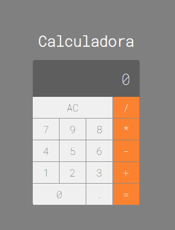

# Calculadora - MacOS

 Calculadora desenvolvida com React.JS, layout construído clonando a interface da calculadora do MacOS. Projeto proposto no curso de <a href="https://www.udemy.com/share/1013eSB0sYcV5aTXQ=/"> Web Moderno da COD3R. </a>

## Resultado

## Como clonar
Clone esse repositório utilizando o seguinte comando:
### `git clone https://github.com/blirag/calculator-macOS.git`
 

Instale as dependências com:
### `npm install`
 

Execute o projeto com:

### `npm start`

## Saiba mais

Para saber mais sobre React, veja a [Documentação](https://reactjs.org/).

criado por Beatriz Lira 🎈

